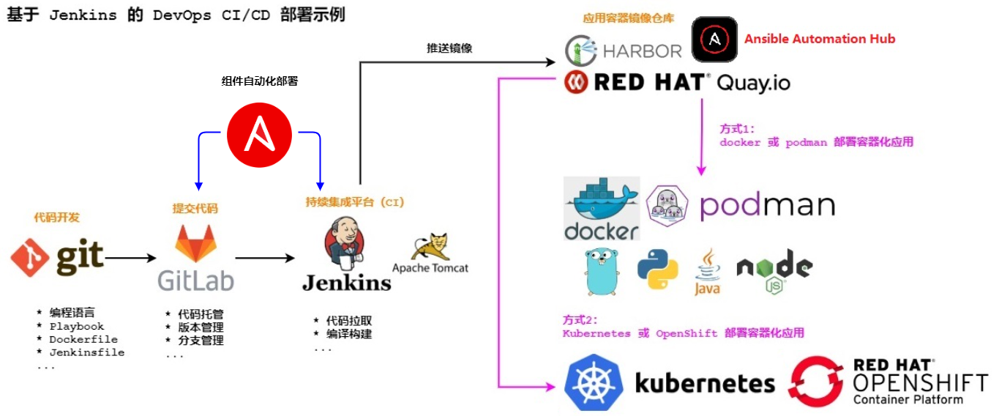
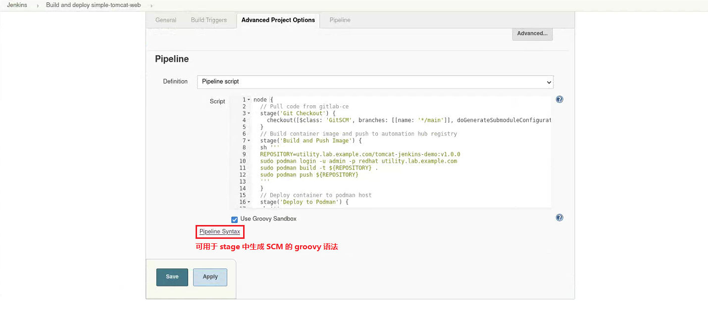
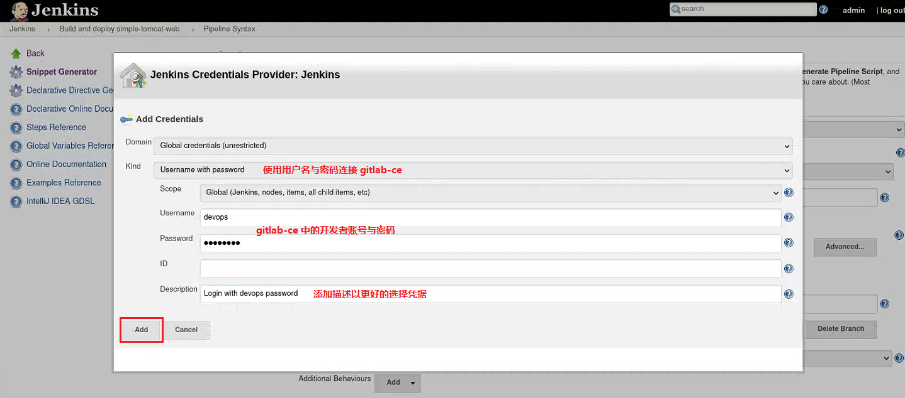
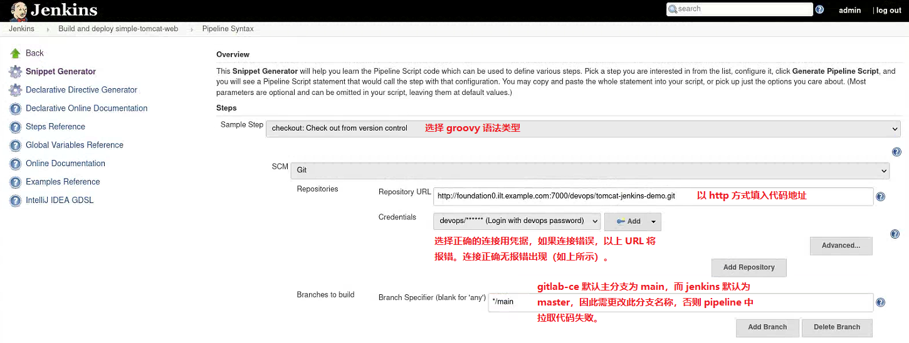
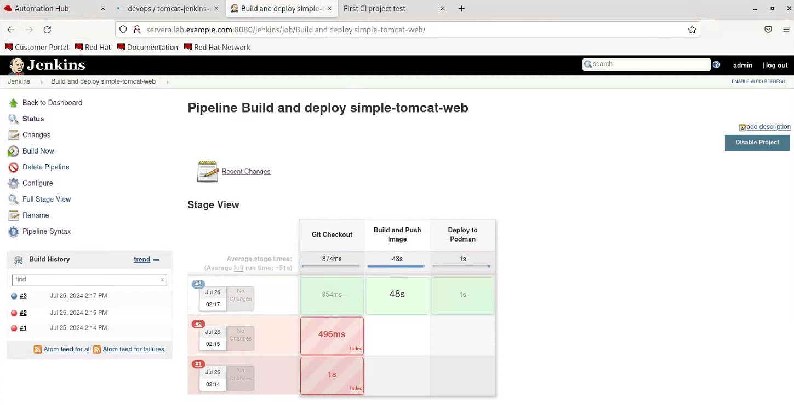

# ♾ Deploy and manage GitLab-CE and Jenkins CI platform by Ansible

- Note: The demo is JUST a lab practice, if you want to use in your environment, please change and test it!

- Environment required:
  
  - Access external internet network
  - Locate ansible-cicd-plt.tgz in `devops@foundationX.ilt.example.com:~` after creating devops user
  - Change foundationX to your foundation number, for example, foundation1, foundation2 and so on

- Directory structure of lab:
  
  ```bash
  @foundationX:
  (devops)$ tree -L 3 ~/ansible-cicd-plt
  /home/devops/ansible-cicd-plt
  ├── 10-provision-gitlab-ce.yml
  ├── 20-provision-container-image.yml
  ├── 30-provision-tomcat-jenkins.yml
  ├── ansible.cfg
  ├── ansible-gitlab-jenkins-cicd-platform-demo.png
  ├── ansible-navigator.log
  ├── ansible-navigator.yml
  ├── collections
  │   ├── ansible_collections
  │   │   ├── community
  │   │   ├── community.general-8.5.0.info
  │   │   ├── containers
  │   │   └── containers.podman-1.15.3.info
  │   └── requirement.yml
  ├── example-pics
  │   ├── 01-automation-hub-tomcat-image.png
  │   ├── 02-gitlab-ce-devops-project.png
  │   ├── 03-jenkins-pipeline-build-deploy-container-1.png
  │   ├── 03-jenkins-pipeline-build-deploy-container-2.png
  │   ├── 03-jenkins-pipeline-build-deploy-container-3.png
  │   ├── 03-jenkins-pipeline-build-deploy-container-4.png
  │   └── 04-simpleserver-demo.png
  ├── files
  │   ├── Containerfile
  │   ├── gitlab_gitlab-ce.repo
  │   ├── gitlab.rb
  │   ├── index.jsp
  │   └── Jenkinsfile
  ├── inventory
  ├── packages
  │   ├── apache-tomcat-9.0.30.tar.gz
  │   ├── gitlab-ce-17.2.0-ce.0.el9.x86_64.rpm
  │   ├── harbor-offline-installer-v1.8.1.tgz
  │   ├── jdk-8u191-linux-x64.tar.gz
  │   ├── jenkins-2.204.2.war
  │   └── jenkins-plugins.tgz
  ├── README.md
  ├── secrets
  │   ├── gitlab_auth.yml
  │   └── hub_auth.yml
  └── tomcat-v1.0.0.tar
  ```

- Topology of lab:
  
  

- Steps of lab:
  
  - Prepare devops user, disable firewalld and selinux:

    ```bash
    @foundationX:
    (kiosk) $ su - root  # type password 'Asimov'
    
    (root)  # useradd devops && \
              echo redhat | passwd --stdin devops && \
              echo "devops  ALL=(ALL)  NOPASSWD:ALL" > /etc/sudoers.d/devops && \
              dnf install -y python3-pip podman && \
              systemctl stop firewalld.service && systemctl disable firewalld.service && \
              sed -i -e 's/SELINUX=enforcing/SELINUX=disabled/' /etc/selinux/config && \
              grubby --update-kernel ALL --args selinux=0
    (root)  # reboot
    ```
  
  - Prepare lab material and install ansible-navigator:

    ```bash
    @foundationX:
    (kiosk) $ su - devops  # type password 'redhat'
    
    (devops)$ tar -zxf ansible-cicd-plt.tgz
    (devops)$ ssh-keygen
    (devops)$ ssh-copy-id devops@foundationX.ilt.example.com    # type password 'redhat'
    (devops)$ ssh-copy-id devops@servera.lab.example.com        # type password 'redhat'
    (devops)$ mkdir ~/.pip
    (devops)$ vim ~/.pip/pip.conf
    [global]
    index-url=http://mirrors.aliyun.com/pypi/simple/
    [install]
    trusted-host=mirrors.aliyun.com
    # change pip3 source index to accelerate installation
    (devops)$ pip3 install ansible-navigator --user  # install in user env
    ```
  
  - Prepare execution environment image:

    ```bash
    @foundationX:
    (devops)$ podman login -u admin -p redhat utility.lab.example.com --tls-verify=false
    (devops)$ podman pull utility.lab.example.com/ansible-automation-platform-22/ee-supported-rhel8:latest --tls-verify=false
    ```
  
  - Install collections in collections directory:

    - community.general and containers.podman collection installed in collections directory
    - If previous collections is NOT existing, run following commands:

      ```bash
      @foundationX:
      (devops)$ cd ~/ansible-cicd-plt
      (devops)$ ansible-galaxy collection install -r collections/requirement.yml -p collections  # optional: collections installed
      (devops)$ ansible-galaxy collection list
      ```
  
  - **GitLab CE deploy and manage:**

    ```bash
    @foundationX:
    (devops)$ cd ~/ansible-cicd-plt
    (devops)$ sudo yum install -y https://mirrors.aliyun.com/epel/epel-release-latest-9.noarch.rpm
    (devops)$ vim inventory  # change foundation0 to foundationX
    (devops)$ vim files/gitlab.rb  # line32: change foundation0 to foundationX
    
    (devops)$ ansible-navigator run -m stdout 10-provision-gitlab-ce.yml --skip-tag create_user --skip-tag create_project -vvv  # verify whole progress
    (devops)$ sudo cat /etc/gitlab/initial_root_password | grep ^Password | awk '{print $2}'  # get gitlab root password
    (devops)$ cat ~/.ssh/id_rsa.pub  # get devops ssh pubkey
    (devops)$ vim secrets/gitlab_auth.yml  # modify lines with CHANGE ME
    (devops)$ ansible-navigator run -m stdout 10-provision-gitlab-ce.yml --tag create_user
    (devops)$ ansible-navigator run -m stdout 10-provision-gitlab-ce.yml --tag create_project
    ```

    Open firefox and use devops account and password to login `http://foundationX.ilt.example.com:7000`, and you will find the project is in it.
  
  - Tomcat container image synchronize into automation hub:

    ```bash
    @foundationX:
    (devops)$ cd ~/ansible-cicd-plt
    (devops)$ ansible-navigator run -m stdout 20-provision-container-image.yml    
    ```

    Open firefox and use admin/redhat to login automation hub, and verify tomcat image in Execution Environment.
  
  - JDK, Tomcat and Jenkins deploy and set environment:

    ```bash
    @foundationX:
    (devops)$ cd ~/ansible-cicd-plt
    (devops)$ ansible-navigator run -m stdout 30-provision-tomcat-jenkins.yml --skip-tag config_plugins
    (devops)$ ssh devops@servera
    
    @servera:
    (devops)$ source /etc/profile && /home/devops/tomcat-jenkins/bin/startup.sh
    Using CATALINA_BASE:   /home/devops/tomcat-jenkins
    Using CATALINA_HOME:   /home/devops/tomcat-jenkins
    Using CATALINA_TMPDIR: /home/devops/tomcat-jenkins/temp
    Using JRE_HOME:        /usr/local/jdk1.8.0_191/jre
    Using CLASSPATH:       /home/devops/tomcat-jenkins/bin/bootstrap.jar:/home/devops/tomcat-jenkins/bin/tomcat-juli.jar
    Tomcat started.
    ```

    Open firefox and access `http://servera.lab.example.com:8080/jenkins` to init jenkins.
  
  - Jenkins plugins install:

    ```bash
    @servera:
    (devops)$ /home/devops/tomcat-jenkins/bin/shutdown.sh
    
    @foundationX:
    (devops)$ cd ~/ansible-cicd-plt
    (devops)$ ansible-navigator run -m stdout 30-provision-tomcat-jenkins.yml --tag config_plugins
    
    @servera:
    (devops)$ /home/devops/tomcat-jenkins/bin/startup.sh
    ```

    Login jenkins again to verify installed plugins.
  
  - Update code to gitlab-ce:

    ```bash
    @foundationX:
    (devops)$ cd ~/ansible-cicd-plt
    (devops)$ git clone http://foundationX.ilt.example.com:7000/devops/tomcat-jenkins-demo.git
    (devops)$    cp files/{Containerfile,index.jsp} tomcat-jenkins-demo/
    (devops)$ cd tomcat-jenkins-demo/
    (devops)$ git config --global user.email devops@lab.example.com
    (devops)$ git config --global user.name devops
    (devops)$ git add .
    (devops)$ git commit -m "First update project"
    (devops)$ git push origin main    # user: devops, password: 1qazZSE$
    ```
  
  - Jenkins pipeline create and start:

    - Open firefox and login jenkins.

    - Create pipeline, add scm credential, generate pipeline and so on. Follow the images in example-pics directory.

      

      

      

      

    - Build pipeline to view the progress.
  
  - Access webapp:

    - Access `http://servera.lab.example.com:8880/simpleServer/`

- References:
  
  - [Ansible Doc - Community.General](https://docs.ansible.com/ansible/latest/collections/community/general/index.html)
  - [Install GitLab CE on RHEL 9 | CentOS 9](https://infotechys.com/install-gitlab-ce-on-rhel-9/)
